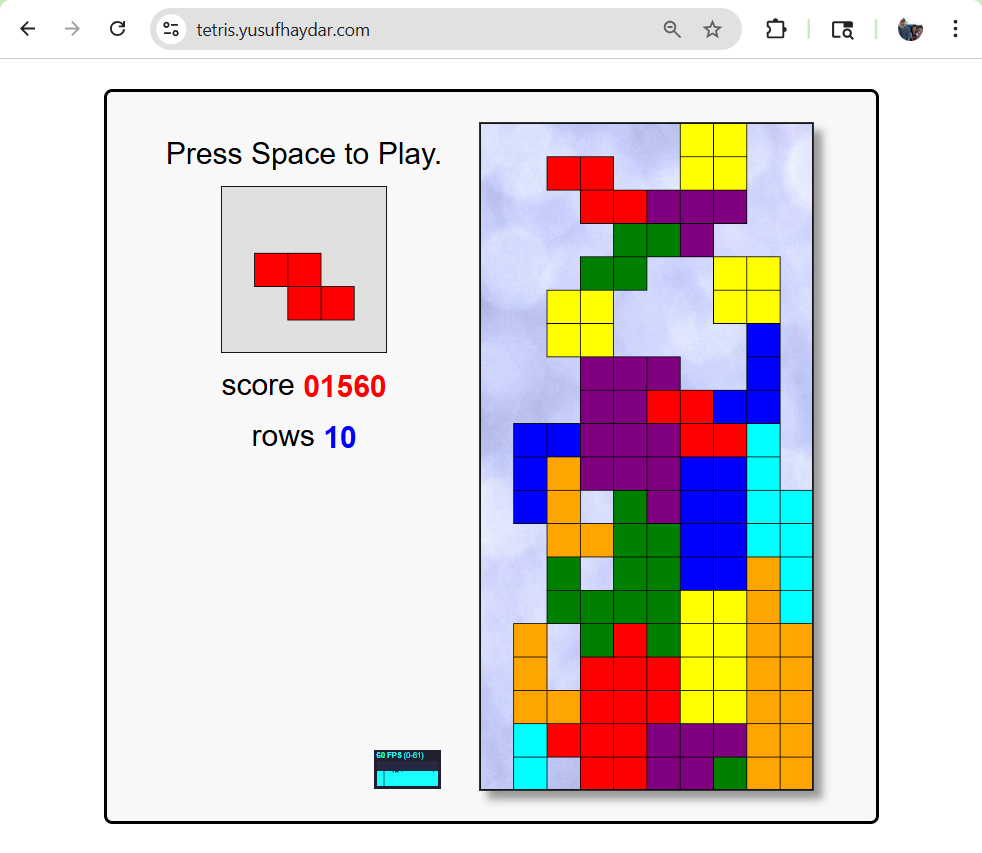
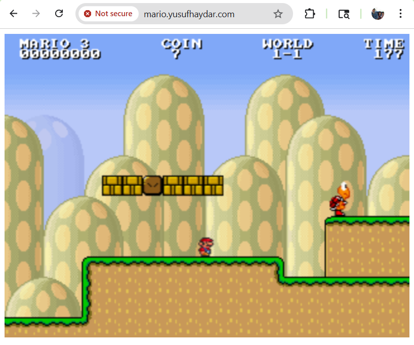

# Kubernetes Games

##### Background:
I was in the interview process for a DevOps role, that mentioned **kubernetes** on the job description. Although I was a big fan of container technology and container orchestration tooling, I had no experience actually setting up a cluster. This led me to first complete a Linkedin Learning course, [Kubernetes: Microservices](https://www.linkedin.com/learning/kubernetes-microservices-23787657?u=0). Here I set up a local minikube cluster with Calico as the CNI(container network interface), deployed backend and frontend services, configured pod to pod network policies, and set up an nginx ingress controller. Although this was cool, I wanted to set up a cluster that felt really cool.

I first found [Deploying Super Mario game on Kubernetes](https://developer.hpe.com/blog/deploying-super-mario-game-on-kubernetes-in-hpe-greenlake-for-private-cloud-enterprise/), and wanted to follow along, although I was going to use Azure Kubernetes Services instead of HPE because I had already started a free 30 day account. To this end, I found this article, [Deploy AKS cluster using Terraform](https://learn.microsoft.com/en-us/azure/aks/learn/quick-kubernetes-deploy-terraform?pivots=development-environment-azure-cli) and hoped to use both to achieve my goal.
#
##### Process (simplified here, but was not so simple at first):
Using the Terraform article as a guide, I grabbed the tf files, making some small changes like changing `vm_size = "Standard_D2_v2"` to `vm_size = "standard_dc2as_v5"`. This change only came from getting errors when running `terraform apply` later on. Standard_dc2as_v5 seemed to be the cheapest VM option available to me in my free plan.

1. Run `az login` on your local command line. Follow link to site to login.
2. Copy `providers.tf, ssh.tf, main.tf, variables.tf, outputs.tf` from the [article](https://learn.microsoft.com/en-us/azure/aks/learn/quick-kubernetes-deploy-terraform?pivots=development-environment-azure-cli).
3.  Run `terraform init -upgrade`
4.  Run `terraform plan -out main.tfplan`
5.  Run `terraform apply main.tfplan`. Give it a few minutes to set up the cluster (took 5m15s for me).
6. Set a variable to hold your new resource group name: `resource_group_name=$(terraform output -raw resource_group_name)`
7.  Check out your new aks cluster name with this command (using the resource group name you saved): `
    az aks list \
      --resource-group $resource_group_name \
      --query "[].{\"K8s cluster name\":name}" \
      --output table`
8. Save the Kubernetes config so that local kubectl command can communicate with remote cluster: `
    echo "$(terraform output kube_config)" > ./azurek8s`
9.  Remove `<< EOT` at the beginning and `EOT` at the end of the azurek8s file if you see them in there.
10.  Set local environment variable for kubectl to know where the config file is `export KUBECONFIG=./azurek8s`
11. Your cluster is officially set up and you can see the cluster nodes with `kubectl get nodes`.
12. `kubectl apply -f games.yaml`
13. `kubectl apply -f ingress.yaml`
14. `kubectl apply -f https://raw.githubusercontent.com/kubernetes/ingress-nginx/controller-v1.14.1/deploy/static/provider/cloud/deploy.yaml
` ([Azure Specific](https://kubernetes.github.io/ingress-nginx/deploy/#azure)) 
15. `kubectl apply -f https://github.com/cert-manager/cert-manager/releases/download/v1.19.2/cert-manager.yaml` 
16. `kubectl apply -f certificate.yaml`
17. `kubectl apply -f cluster-issuer.yaml`
18. Wait 10 min
19. Play Tetris and Mario!!!!

 
> Written with [StackEdit](https://stackedit.io/).
